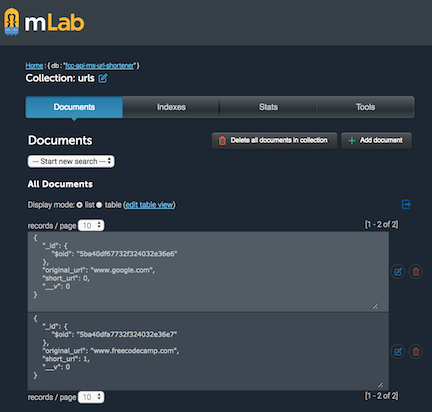
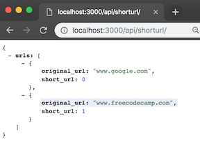
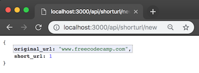
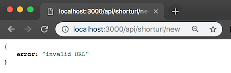
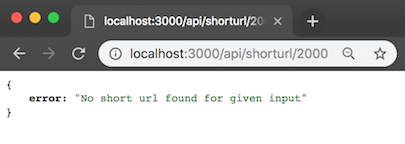

# API Project: URL Shortener Microservice for freeCodeCamp - Completed

## View on [Glitch](https://glitch.com/edit/#!/zenith-door)

## Endpoints created:

GET /api/shorturl

POST /api/shorturl/new

GET /api/shorturl/:id => /api/shorturl/1 => should redirect browser to original_url

## To run this project locally

1. Https or SSH download this project.
2. `npm install`
3. [Critical] Populate process.env.MONGOLAB_URI with your mongoDB URI from mLab
4. Navigate to localhost:3000/

### User Stories

1. I can POST a URL to `[project_url]/api/shorturl/new` and I will receive a shortened URL in the JSON response. Example : `{"original_url":"www.google.com","short_url":1}`
2. If I pass an invalid URL that doesn't follow the valid `http(s)://www.example.com(/more/routes)` format, the JSON response will contain an error like `{"error":"invalid URL"}`. _HINT_: to be sure that the submitted url points to a valid site you can use the function `dns.lookup(host, cb)` from the `dns` core module.
3. When I visit the shortened URL, it will redirect me to my original link.

#### Creation Example:

POST [project_url]/api/shorturl/new - body (urlencoded) : url=https://www.google.com

#### Usage:

[this_project_url]/api/shorturl/3

#### Will redirect to:

http://forum.freecodecamp.com
